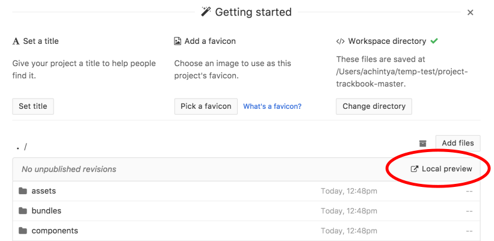

:tada: :heart: Hello and welcome to Project Trackbook! :tada: :heart:

* Follow [OPEN Open Source Project](http://openopensource.org/) practices
* Run `npm test` before opening a PR
* Fill out the description in the PR

## Commands

* `npm start` - Bundle assets and watch for changes
* `npm run build` - Bundle assets for deployment
* `npm test` - Run `standard` to check for code errors

### Development Tips

This project needs to be developed with the Beaker Browser. In the current version `v0.8.0-prerelease.5`, this can be a bit complicated. Follow these tips:

1. Clone the directory to your computer:

```bash
git clone https://github.com/dat-land/project-trackbook.git
```

2. Navigate into your newly cloned directory:

```bash
cd project-trackbook
```

3. Get `npm` to install all the required dependencies and then start to bundle & watch the files:

```bash
npm install
npm start
```

4. Launch [Beaker Browser](https://beakerbrowser.com/). Make sure you have the latest version installed: [install/update Beaker](https://beakerbrowser.com/docs/install/) if needed!
5. Launch Beaker, navigate to `Menu` &rarr; `Create New` &rarr; `From Folder` and select the folder where you cloned `project-trackbook`.

6. Click on `Local preview` above the file browser to see your workspace.

