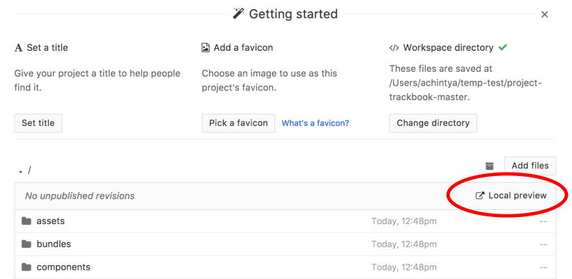

# project-trackbook

**Description:** Open lab notebook giving researchers an interface to securely share and version control files in decentralized network.

**eLife Sprint GOAL:** Create alpha MVP to demonstrate functionality.


## Commands

1. Clone the directory to your computer:

```bash
git clone https://github.com/dat-land/project-trackbook.git
```

2. Navigate into your newly cloned directory:

```bash
cd project-trackbook
```

3. Get `npm` to install all the required dependencies and then start the trackbook backend:

```bash
npm install
npm start
```

4. Launch [Beaker Browser](https://beakerbrowser.com/). Make sure you have the latest version installed: [install/update Beaker](https://beakerbrowser.com/docs/install/) if needed!
5. Launch Beaker, navigate to `Menu` &rarr; `Create New` &rarr; `From Folder` and select the folder where you cloned `project-trackbook`.

6. Click on `Local preview` above the file browser to see your workspace.


**More instructions coming soon.**
